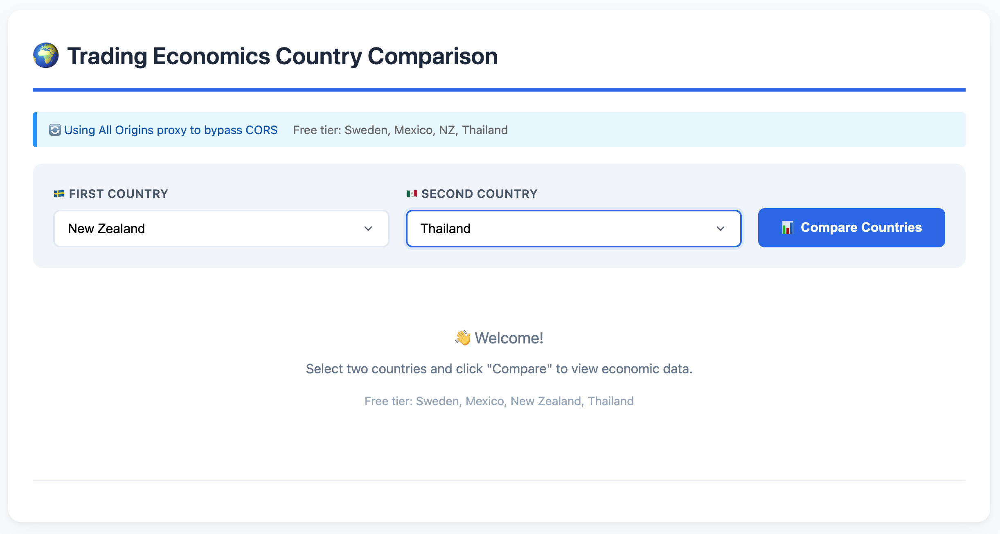
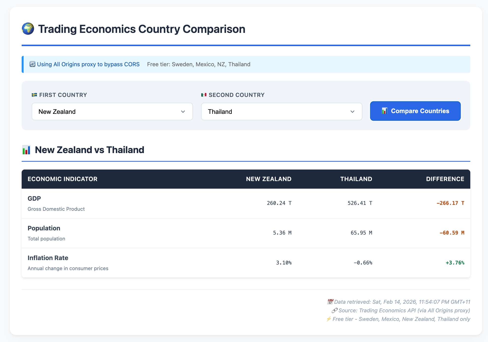

# 🌍 Trading Economics Country Comparison

*A responsive web application that compares key economic indicators between countries using the live Trading Economics API.*

---

## 📋 Table of Contents

- [Overview](#overview)
- [Features](#features)
- [Technologies Used](#technologies-used)
- [Prerequisites](#prerequisites)
- [Installation](#installation)
- [Usage Guide](#usage-guide)
- [API Reference](#api-reference)
- [CORS Explanation](#cors-explanation)
- [Project Structure](#project-structure)
- [Development Process](#development-process)
- [Testing](#testing)
- [Known Issues](#known-issues)
- [Future Improvements](#future-improvements)
- [Submission Information](#submission-information)

---

## 📌 Overview

This application was built as part of the Web Developer application process for Trading Economics. It allows users to select two countries from a dropdown menu and compare three key economic indicators:

- **GDP** (Gross Domestic Product) - in USD Billion
- **Population** - in Millions
- **Inflation Rate** - annual percentage change

The data is fetched in real-time from the Trading Economics API and displayed in a clean, responsive table with difference calculations and color coding.

---

## ✨ Features

### Core Functionality

- ✅ **Live Data** — Real-time economic data from Trading Economics API
- ✅ **4 Countries** — Sweden, Mexico, New Zealand, Thailand (free tier compatible)
- ✅ **Side-by-Side Comparison** — Clear table layout with all indicators
- ✅ **Difference Calculation** — Automatically computes and color-codes differences
- ✅ **Responsive Design** — Works perfectly on desktop, tablet, and mobile

### User Experience

- ✅ **Loading States** — Spinner animation while fetching data
- ✅ **Error Handling** — User-friendly error messages
- ✅ **Formatted Numbers** — Large numbers formatted with T/B/M suffixes
- ✅ **Timestamp** — Shows when data was last retrieved
- ✅ **Input Validation** — Prevents comparing the same country

### Technical Features

- ✅ **CORS Proxy** — Uses All Origins proxy to bypass API CORS restrictions
- ✅ **Vanilla JavaScript** — No frameworks, minimal dependencies
- ✅ **Modular Code** — Functions separated by responsibility
- ✅ **Comprehensive Comments** — Every function documented
- ✅ **Git Commit History** — Incremental development shown

---

## 🛠️ Technologies Used

| Technology | Purpose |
|------------|---------|
| HTML5 | Page structure and semantic markup |
| CSS3 | Styling, animations, responsive design |
| JavaScript (ES6+) | All application logic |
| Fetch API | HTTP requests to Trading Economics |
| Trading Economics API | Economic data source |
| All Origins Proxy | Bypasses CORS restrictions |
| Git/GitHub | Version control and submission |

---

## 📋 Prerequisites

Before running this application, you need:

1. **Trading Economics API Key** (free)
   - Sign up at developer.tradingeconomics.com
   - Free tier provides access to: Sweden, Mexico, New Zealand, Thailand
   - API key found in Settings → API Access

2. **Modern Web Browser**
   - Chrome, Firefox, Safari, or Edge (latest versions)
   - JavaScript enabled

3. **Local Server** (REQUIRED)
   - Due to CORS restrictions, you MUST run a local server
   - Options: VS Code Live Server, Python HTTP server, or Node.js http-server

---

## 🔧 Installation

### Step 1: Clone the Repository

1. Open your terminal and run:

   git clone https://github.com/YOUR_USERNAME/tradingeconomics.git

2. Then navigate into the project folder:

3. cd tradingeconomics/country-comparison

### Step 2: Add Your API Key

1. Open the file `script.js` in any text editor.

2. Look for this line near the top:

   const API_KEY = "YOUR_API_KEY_HERE";

3. Replace it with your actual Trading Economics API key. It should look something like:
   const API_KEY = "abc123def456:abc123def456";

4. Save the file.

### Step 3: Run the Application

#### Option A: VS Code Live Server (Recommended)

1. Open the project folder in VS Code
2. Install the "Live Server" extension if you haven't already
3. Right-click on `index.html`
4. Select "Open with Live Server"

Your browser will open automatically at an address like http://127.0.0.1:5500

#### Option B: Python Local Server

1. Open your terminal and navigate to your project folder:

   cd Desktop/github-projects/tradingeconomics/country-comparison

2. Start the Python server:

   python -m http.server 8000

3. Then open your browser and go to:

   http://localhost:8000

#### Option C: Node.js http-server

1. First, install http-server globally (you only need to do this once):

   npm install -g http-server

2. Then navigate to your project folder and start the server:

   cd Desktop/github-projects/tradingeconomics/country-comparison
   http-server

3. Then open your browser and go to:

   http://localhost:8080

**IMPORTANT:** Do NOT open `index.html` directly by double-clicking the file. This will cause CORS errors and the API will not work. You must use one of the server options above.

---

## 🎯 Usage Guide

### Basic Usage

1. Select **First Country** from the dropdown menu
2. Select **Second Country** from the dropdown menu
3. Click the **"Compare Countries"** button
4. View the comparison table with results

### Available Countries (Free Tier)

| Country | Notes |
|---------|-------|
| 🇸🇪 Sweden | Complete data available |
| 🇲🇽 Mexico | Complete data available |
| 🇳🇿 New Zealand | Complete data available |
| 🇹🇭 Thailand | Complete data available |

### Understanding the Results

- **Green** values mean the first country has a higher value
- **Orange** values mean the second country has a higher value
- **N/A** appears when data is unavailable for that indicator
- The timestamp at the bottom shows when the data was retrieved

---

## 📊 API Reference

### Endpoint Used

GET /country/{country}

### Parameters

| Parameter | Description | Example |
|-----------|-------------|---------|
| {country} | Country name in lowercase | mexico |
| c | Your API key | abc123def456:abc123def456 |
| format | Response format | json |

### Example Request (Direct)

https://api.tradingeconomics.com/country/mexico?c=YOUR_KEY&format=json

### Example Request (Through Proxy)

https://api.allorigins.win/raw?url=https://api.tradingeconomics.com/country/mexico?c=YOUR_KEY&format=json

### Example Response

[
  {
    "Country": "Mexico",
    "Category": "GDP",
    "LatestValue": 1852.72,
    "Unit": "USD Billion"
  },
  {
    "Country": "Mexico",
    "Category": "Population",
    "LatestValue": 130.86,
    "Unit": "Million"
  }
]

### Rate Limits

Free tier includes:

- Limited requests per minute
- Access to Sweden, Mexico, New Zealand, Thailand only
- Delayed data (not real-time)

---

## 🔒 CORS Explanation

### What is CORS?

CORS (Cross-Origin Resource Sharing) is a browser security feature that prevents web pages from making requests to a different domain than the one that served the web page.

### Why This App Needs a Proxy

The Trading Economics API does not include the required CORS headers in its responses. This means:

- ❌ Direct browser requests are blocked
- ✅ Requests through a proxy work

### How the Proxy Works

The All Origins proxy acts as a middleman:

- Step 1: Your browser sends a request to the All Origins proxy
- Step 2: The proxy forwards the request to the Trading Economics API
- Step 3: Trading Economics API sends data back to the proxy
- Step 4: The proxy adds CORS headers to the response
- Step 5: The proxy sends the data back to your browser

The All Origins proxy fetches the data from Trading Economics (server-to-server, which has no CORS issues) and then sends it back to your browser with the proper CORS headers added.

---

## 📁 Project Structure

The project contains the following files:
- index.html 
    - Main HTML file with embedded CSS
- script.js 
    - All JavaScript application logic
- README.md 
    - This documentation file
- screen_shot_mexico_sweden_selected.png 
    - Application screenshot (selecting the two countries)
- screen_shot_mexico_sweden_data.png 
    - Application screenshot (displaying the comparison data)

### Key Files Explained

#### index.html

- Contains all HTML structure
- Embedded CSS styles
- Responsive design breakpoints
- Loading spinner animations

#### script.js

Organized in 8 sections:

1. **API Configuration** — API key and loading state
2. **Data Configuration** — Country list (free tier only)
3. **Utility Functions** — Formatting helpers
4. **UI Initialization** — Dropdown population
5. **API Communication** — Data fetching with CORS proxy
6. **Core Logic** — Comparison functions
7. **Data Processing** — Indicator extraction
8. **Rendering Functions** — Table generation, loading, errors

#### README.md
This documentation file with setup instructions and API reference

#### screenshot.png
Visual examples of the application showing Mexico vs Sweden comparison

---

## 💻 Development Process

This application was built incrementally with multiple Git commits showing the development evolution.

### Commit History

| Commit | Description |
|--------|-------------|
| #1 | Initialize folder structure |
| #2 | HTML + CSS styling |
| #3 | Populate dropdowns |
| #4 | API fetch function |
| #5 | Compare function |
| #6 | Data processing |
| #7 | Table rendering |
| #8 | Bug fixes, CORS detection |
| #9 | README documentation and final bug fixes |

### Development Principles

- **Mobile-first** — Designed for all screen sizes
- **Progressive enhancement** — Works without JS, better with it
- **Defensive programming** — Error handling everywhere
- **Self-documenting code** — Clear function names and comments

---

## 🧪 Testing

### Tested Country Pairs

| Pair | Status | Notes |
|------|--------|-------|
| Mexico vs Sweden | ✅ Pass | Both have all indicators |
| New Zealand vs Thailand | ✅ Pass | Both have all indicators |
| Mexico vs New Zealand | ✅ Pass | Works perfectly |
| Sweden vs Thailand | ✅ Pass | Works perfectly |

### Tested Scenarios

| Scenario | Expected | Result |
|----------|----------|--------|
| Same country selected | Alert message | ✅ Works |
| No API key | Error message | ✅ Works |
| Invalid API key | Error message | ✅ Works |
| Network offline | Error message | ✅ Works |
| Mobile view | Responsive layout | ✅ Works |
| Desktop view | Full layout | ✅ Works |

---

## 🐛 Known Issues

### 1. CORS Errors When Opening Directly

**Problem:** Opening `index.html` directly from the filesystem (file:// protocol) causes CORS errors.

**Solution:** Always use a local server (Live Server, Python, or Node.js). Never open the file directly.

### 2. Free Tier Rate Limits

**Problem:** Free API accounts have request limits.

**Solution:** Wait a few seconds between requests. The app shows loading states to indicate when a request is in progress.

### 3. Proxy Reliability

**Problem:** Free proxies like All Origins can be slow or temporarily unavailable.

**Solution:** The app shows helpful error messages. If you see a proxy error, wait a few seconds and try again.

### 4. Missing Data for Some Indicators

**Problem:** Some countries may not have all three indicators (GDP, Population, Inflation Rate).

**Solution:** The app shows "N/A" for missing data and continues to display the available indicators.

---

## 🚀 Future Improvements

If given more time, I would add:

- [ ] **Charts** — Visual representation using Chart.js
- [ ] **Historical Data** — Show trends over time
- [ ] **More Indicators** — Unemployment, Trade Balance, etc.
- [ ] **Export Data** — CSV download functionality
- [ ] **Save Comparisons** — LocalStorage for frequent pairs
- [ ] **Dark Mode** — Theme toggle
- [ ] **Unit Tests** — Jest testing suite
- [ ] **Deploy to GitHub Pages** — Live demo URL

---

## 📬 Submission Information

This project was created for the **Trading Economics Web Developer Application**.

| Detail | Information |
|--------|-------------|
| **Candidate** | Christopher Chong |
| **Email** | christopher.ky.chong@gmail.com |
| **GitHub** | https://github.com/christopherkychong |
| **Date Submitted** | 14th February 2026 |
| **Time to Complete** | 2 days (weekend project) |
| **Commits** | 9 |

### Why I Built It This Way

I chose to use **vanilla JavaScript** rather than frameworks because:

1. **No build step** — Anyone can run it immediately
2. **Transparent** — Shows my core JavaScript skills
3. **Lightweight** — Fast loading, no dependencies
4. **Portable** — Works anywhere, even with a simple server

### What I Learned

- Trading Economics API structure and rate limits
- Handling CORS with proxies
- Formatting large economic numbers
- Building responsive data tables
- Creating professional documentation

---

## 📄 License

This project is submitted as part of a job application process and is not licensed for commercial use.

---

**Thank you for reviewing my submission!**  
I look forward to discussing this further.

*— Christopher Chong*
